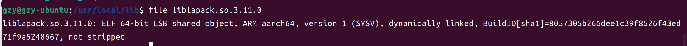

# CasADI 嵌入式部署 ubuntu系统

上期更新了CasADI求解工具在Windows系统中Visual Studio 2019中的部署方案，本期更新CasADI求解工具在Ubuntu系统中的部署方案。由于最终目的是在Xilinx MPsoc系列FPGA开发版上进行硬件实现，开发软件选择了Vitis2022.2 IDE。开发板集成了cortex-A53的CPU，属于aarch64架构。

系统环境：ubuntu20.04 (原来使用ubuntu22.04,由于GLIBC版本问题，改回了ubuntu20.04，具体原因参见下一篇Vitis部署篇)

IDE：Vitis2022.2

参考文档：

[IPOPT官方安装教程](https://coin-or.github.io/Ipopt/INSTALL.html)

[NLP非线性优化第三步CasAdi在嵌入式平台的部署](https://zhuanlan.zhihu.com/p/562667670)

## 1.源码编译方案

### 下载编译器

由于我采用的是64位ARM处理器，因此下载aarch64-linux-gnu-gcc编译器(如果32位可以下载arm-linux-gnueabihf-gcc编译器)，同时需要安装对应的g++编译器aarch64-linux-gnu-gcc，执行命令

    sudo apt install gcc-aarch64-linux-gnu gfortran-aarch64-linux-gnu

编译lapack时需要gfortran编译器。
### 下载预编译文件

    sudo apt install libblas-dev liblapack-dev libmetis-dev gcc g++ cmake make

注意此时安装的blas和lapack默认为x86_64架构架构的。
### 下载Blas和Lapack并编译
由于Lapack源码中包含了Blas，只用下载Lapck即可，从[BLAS github官网](https://github.com/Reference-LAPACK/lapack)下载Lapack源码，或者输入以下命令：

    git clone https://github.com/Reference-LAPACK/lapack.git

Lapack采用Cmake生成makefile文件，需要指定Cmake使用aarch64交叉编译器，进入文件夹，建立一个build文件夹，进入build文件夹，执行

    cmake .. -DCMAKE_C_COMPILER=/usr/bin/aarch64-linux-gnu-gcc -DCMAKE_Fortran_COMPILER=/usr/bin/aarch64-linux-gnu-gfortran -DBUILD_SHARED_LIBS=ON

其中/usr/bin是采用apt install安装的默认安装路径，一定要记得添加-DBUILD_SHARED_LIBS=ON参数，具体原因会在后面说明。

**编译Lapack**

    sudo make -j8

其中j8参数指定CPU采用8线程进行编译，能够提升编译速度。

**安装Lapack**(将生成的so文件复制到/usr/local/lib)

    sudo make install

执行完命令后，如果出现以下提示，即安装成功。

安装完毕后可以进入/usr/local/lib目录下执行以下命令确认是否为aarch64架构的动态链接库文件，如果不是需要重新编译。

    file liblapack.so.3.11.0

确认生成aarch64架构的动态链接库后，证明lapack库已经正确安装。

### 下载ASL库并编译
首先需要去[ASL github官方](https://github.com/coin-or-tools/ThirdParty-ASL/)下载ASL源码程序，或执行以下命令

    git clone https://github.com/coin-or-tools/ThirdParty-ASL.git

下载完成之后，进入该目录，运行以下命令得到编译ASL库必要的文件。

    sudo ./get.ASL

ASL库采用autoconfig工具生成makefile文件，执行./configure命令

    sudo ./configure --prefix=/usr/local/ --host=aarch64-linux-gnu

其中--prefix参数指定安装的位置，也可以不指定，--host参数指定编译生成的文件运行的主机环境，由于是交叉编译，要运行在arm64架构的CPU环境下，需要指定arm64的环境，不知道输入什么的可以执行以下命令，可以看到编译器的target，输入target项的内容即可，这个位置踩的小坑。

    aarch64-linux-gnu-gcc -v

**ASL库编译**

    sudo make -j8

**ASL库安装**

    sudo make install

执行完毕后最好进入/usr/local/lib目录执行file命令确认编译出的文件架构是否正确，方法和Lapack库一样。

### 下载HSL库并编译

首先需要去[HSL官方](http://hsl.rl.ac.uk/ipopt)申请，用学校邮箱即可，大概一天左右会通过邮箱返回申请结果。下载对应的文件，将下载的文件解压并将文件夹重命名为coinhsl(也可以在我的github上直接下载)。然后再去[HSL github](https://github.com/coin-or-tools/ThirdParty-HSL)下载HSL源码,执行

    git clone https://github.com/coin-or-tools/ThirdParty-HSL.git

同时将前面重命名为coinhsl的文件夹粘贴到HSL源码目录中。进入HSL源码目录，执行./configure命令生成makefile文件

    sudo ./configure --prefix=/usr/local/ --host=aarch64-linux-gnu

执行该命令后可能会出现找不到lapack库，导致出现报错，

因为编译HSL时执行./configure时需要调用aarch64架构的blas和lapack的动态链接库，否则就会出现报错。而第一步安装的libblas-dev liblapack-dev默认为x86_64架构的动态链接库。因此需要我们自己编译生成aarch64架构的动态链接库，对应前面为什么要加-DBUILD_SHARED_LIBS=ON参数的原因。

**HSL库编译**

    sudo make -j8

**HSL库安装**

    sudo make install

执行完毕后最好进入/usr/local/lib目录执行file命令确认编译出的文件架构是否正确，方法和Lapack库一样。

### 下载Mumps并编译
首先在[Mumps github](https://github.com/coin-or-tools/ThirdParty-Mumps)下载对应的源码，或执行以下命令

    git clone https://github.com/coin-or-tools/ThirdParty-Mumps.git

 进入该目录，执行一下命令生成编译必要的文件。

    sudo ./get.Mumps

 然后执行configure命令生成makefile文件，Mumps同样需要Lapack库，HSL库编译成功之后，Mumps一般也能成功配置。

    sudo ./configure --prefix=/usr/local/ --host=aarch64-linux-gnu

**Mumps库编译**

    sudo make -j8

**Mumps库安装**

    sudo make install
    
### 下载Ipopt并编译
编译了这么多的依赖文件，终于要开始编译优化求解工具IPOPT了，明显感觉到相对于Windows系统复杂多了。在[Ipopt github](https://github.com/coin-or/Ipopt)上下载IPOPT源码，或执行以下命令

    git clone https://github.com/coin-or/Ipopt.git

进入IPOPT源码目录，执行

    sudo ./configure --prefix=/usr/local/ --host=aarch64-linux-gnu

**Ipopt库编译**

    sudo make -j8

 编译Ipopt时可能会报下图这个错误，提示文件格式不正确，然后找到对应的文件，用file命令查看文件格式，发现是x86_64架构的，不知为何。然后去查看config.log文件，发现找不到对应的g++编译器，重新安装g++-aarch64-linux-gnu，编译顺利通过。

 

**Ipopt库安装**

    sudo make install 

### 下载CasADI并编译

在[CasADI github](https://github.com/casadi/casadi)上下载CasADI源码，或执行命令

    git clone https://github.com/casadi/casadi.git
    
进入CasADI源码目录，执行

    cmake .. -DCMAKE_C_COMPILER=/usr/bin/aarch64-linux-gnu-gcc -DCMAKE_CXX_COMPILER=/usr/bin/aarch64-linux-gnu-g++ -DWITH_IPOPT=true

CasADI Cmake时需要使用gcc和g++编译器，需要采用-DCMAKE_C_COMPILER -DCMAKE_CXX_COMPILER指定C和C++的编译器。

**CasADI库编译**

    sudo make -j8

**CasADI库安装**

    sudo make install 

此时生成的动态链接库安装到/usr/local/lib目录，采用file命令确认生成的动态链接库的架构。到此CasADI库编译完成。稍后更新CasADI在Vitis2022.2 IDE中的部署方案，敬请期待。

## 2.Docker方案

不会使用Docker，敬请期待。
