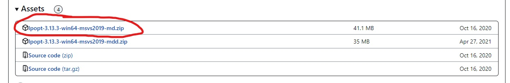
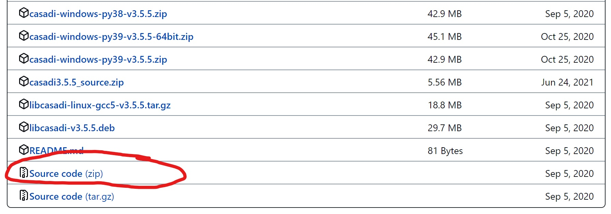
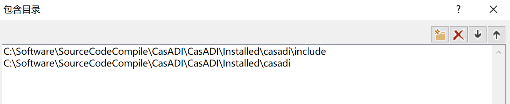
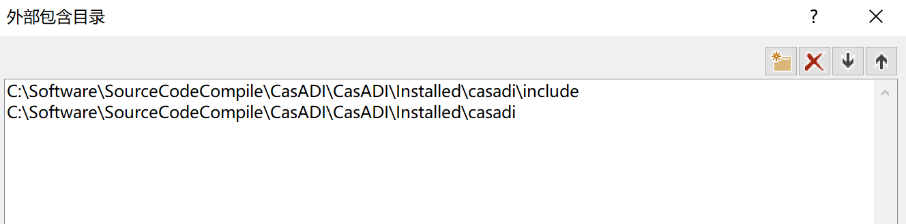
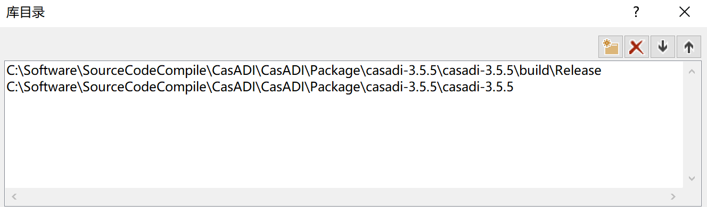
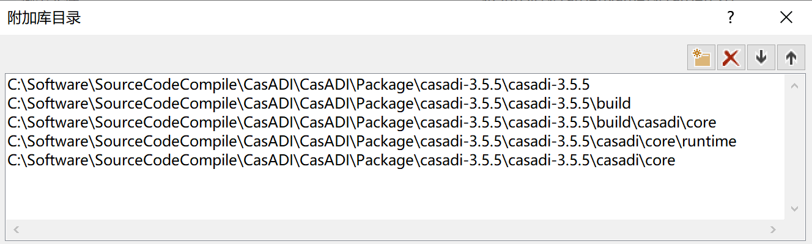
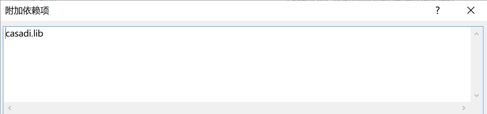
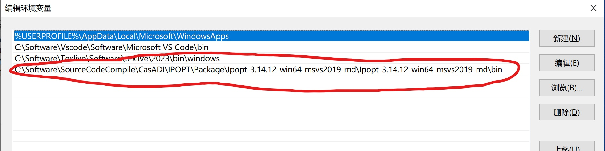

# 优化求解工具CasADI部署

CasADI求解工具能够部署到ZYNQ及MPsoc FPGA开发板中，部署之前最好先在Windows平台的Visual Studio 2019软件上进行验证，然后移植到Linux（由于我使用的是Xilinx MPsoc AXU15EG开发板，是基于Ubuntu20.04系统采用Vitis2020.1软件进行开发，如采用ZYNQ7000系列，可在Windows平台SDSOC2017.4软件上进行交叉编译）平台进行交叉编译。

## Windows Visual Studio 2019

### 1.下载CasADI源码以及IPOPT的Visual Studio 2019预编译程序

CasADI求解器是基于IPOPT软件进行优化求解，因此需要先下载IPOPT,IPOPT在github官网提供了Visual Studio 2019预编译版本，不需要我们编译（大佬可以下载源码版本自行编译），直接去[IPOPT GITHUB官网](https://github.com/coin-or/Ipopt/releases/tag/releases/3.13.3)下载IPOPT的Visual Studio 2019预编译版本即可，选择红线圈住的版本。

接着去[CasADI官网](https://github.com/casadi/casadi/releases)下载CasADI的源码版本，即红线圈住的版本，我选择的是3.5.5版本。

### 2.对下载的程序进行编译

因为IPOPT是Visual Studio 2019编译好的程序，不需对IPOPT进行编译，直接编译CasADI。

#### CasADI编译
1.在CasADI源码根目录下（和README文件同级即可）创建文件run.bat。

    @echo Must be run in a prompt context that defines vcvars.
    @echo For example in 'x64 Native Tools Command Prompt for VS 2019'

    cmake -G "Visual Studio 16 2019" -A x64 -B build -DWITH_IPOPT=ON -DIPOPT_LIBRARIES:FILEPATH="IPOPT根目录/lib/ipopt.dll.lib" -DIPOPT_INCLUDE_DIRS:PATH="IPOPT根目录/include/coin-or"  -DCMAKE_INSTALL_PREFIX:PATH="casadi安装目录/casadi_install"
    cmake --build build --config Release
    cmake --install build
其中**IPOPT根目录**要选择安装的IPOPT对应的文件夹路径，**casadi安装目录**需要指定casadi的安装位置，这里推荐使用绝对路径，**casadi安装目录/casadi_install**文件夹是指定casadi编译完成后生成文件的安装位置，需要自己创建一个。

2.打开Visual Studio 2019对应的x64 Native Tools Command Prompt（一般在开始菜单栏可以找到），切换到CasADI源码根目录下，运行run.bat文件，等待编译完成。

**Tips**：编译CasADI时尽可能选择对应的Visual Studio版本，我用Visual Studio 2022编译了一次，结果果然失败了，提示“iptnlp.hpp”: no such file or directory。所以用其他版本的Visual Studio建议还是自行编译一下对应版本的IPOPT。

具体的编译教程可以参考[官网教程](https://github-wiki-see.page/m/casadi/casadi/wiki/Howto%3A-Use-CasADi-in-Cpp-using-Visual-Studio)。

### 3.Visual Studio 2019软件配置

编译完成之后，需要在Visual Studio 2019 IDE中进行配置，在建立的项目中进行如下配置：

在VC++目录中添加对应的包含目录、外部包含目录、库目录，如下图

包含目录

外部包含目录

以上两个目录是在**casadi安装目录**下，下面的路径均在**casadi源码路径下**。

库目录

在链接器菜单栏配置附加库目录和附加依赖项

附加库目录

附加依赖项

最后一步，动态链接库dll文件是运行exe文件时实时调用的，因此需要将dll文件复制粘贴到生成的exe文件同级目录，将编译生成的casadi.dll以及casadi_nlpsol_ipopt.dll文件粘贴到和生成的exe文件同级的文件夹内，生成的dll文件都在casadi安装目录中，注意区分casadi安装目录和casadi源码目录，在这踩了很多次坑了。

### 4.添加路径到环境变量

添加过动态链接库之后，还会提示找不到casadi_nlpsol_ipopt.dll文件的错误，还需要将IPOPT程序路径添加到系统环境变量的PATH路径中，如何添加系统的环境变量，这里不多介绍了。

## Linux（Ubuntu20.04.1）

由于需要将CasADI运行到ARM架构的FPGA开发板中，需要在Linux上进行交叉编译，官网下载的IPOPT的MSVC2019预编译版本就不能够使用了，需要重新编译ARM架构的IPOPT,而IPOPT的编译需要HSL ASL等依赖库，编译起来相对麻烦，下期更新CasADI的Linux系统部署方案，敬请期待。
