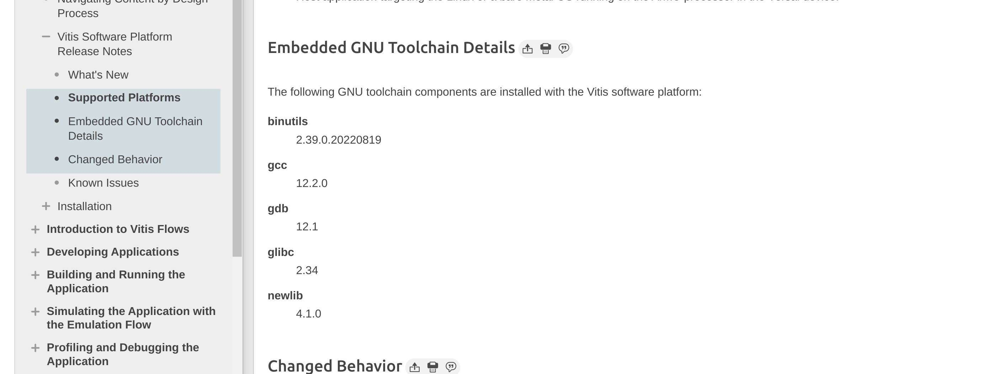
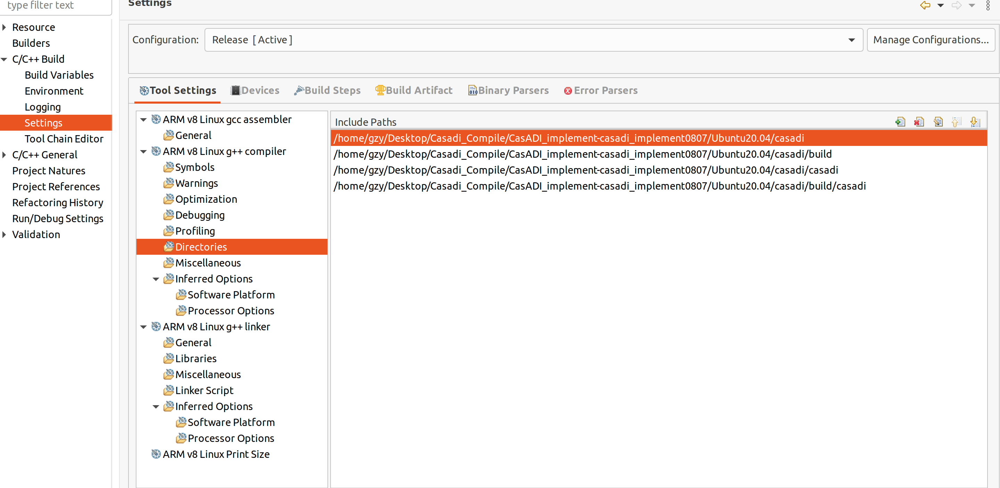
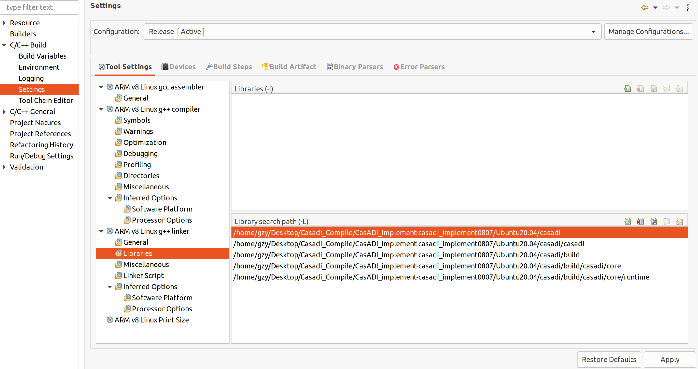
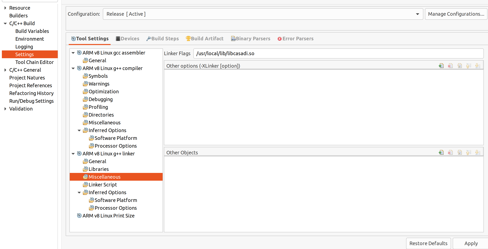

# Vitis 部署

下载Vitis软件，下载软件前，首先确认ubuntu的GLIBC版本。由于涉及到交叉编译，**Vitis软件自带的交叉编译器GLIBC版本不能低于系统的GLIBC版本**，否则交叉编译时会出现undefined reference to `hypot@glibc_2.35'错误。原因是系统编译出来的CasADI动态链接库是基于GLIBC 2.35版本的，而交叉编译工具的GLIBC是2.34版本，低版本无法对高版本的库进行编译。(本人原来使用的是ubuntu22.04系统，对应的GLIBC版本为2.35,出现这个错误。有的大神可以对系统的GLIBC进行降级，可以自己折腾。)

首先通过命令

    ldd --version

查看系统的GLIBC版本

登录赛灵思[Vitis说明文档网站](https://docs.xilinx.com/r/en-US/ug1393-vitis-application-acceleration/Supported-Platforms)查看对应的系统支持版本以及GLIBC版本。系统支持版本自行查阅，GLIBC版本可以通过查看对应的编译工具链看到，如下图

可以看到Vitis软件自带的交叉编译器GLIBC版本是2.34，大于ubuntu20.04的GLIBC版本，可以进行交叉编译。如果是以前的版本文档中不显示，可以在网上查，也可以安装好Vitis软件之后，进入到安装目录下找到 libc.so.6 文件。

    cd /tools/Xilinx/Vitis/2022.2/gnu/aarch64/lin/aarch64-linux/aarch64-xilinx-linux/lib

其中 /tools/Xilinx/ 是Vitis软件的安装目录，输入以下命令

    strings libc.so.6 |grep GLIBC_

可以看到Vitis软件的交叉工具链是2.34版本。

## Vitis软件配置
首先去[赛灵思官网](https://www.xilinx.com/support/download/index.html/content/xilinx/en/downloadNav/vitis.html)下载Vitis软件。下载安装之后，新建一个工程，可以先使用ZCU104（aarch64架构）作为开发板进行开发。配置好开发环境之后，需要配置CasADI对应的包含目录、库目录以及动态链接库。

包含目录

库目录

动态链接库

## ZCU104嵌入式部署

将Vitis软件编译生成的elf文件拷贝到对应的SD卡中，同时需要将生成的.so文件（在/usr/local/lib文件夹中）拷贝到SD卡中（至于是哪些文件不记得了，运行时会提示缺少哪些文件，提示什么就拷贝什么就行了）。随后进入对应的SD卡目录，由于动态链接库文件都在SD卡的目录中，需要将SD卡路径添加到系统的链接路径中，输入命令

    export LD_LIBRART_PATH=SD卡路径

SD卡目录需要改为开发板对应的SD卡路径。现在就可以将CasADI运行在嵌入式开发板中了！